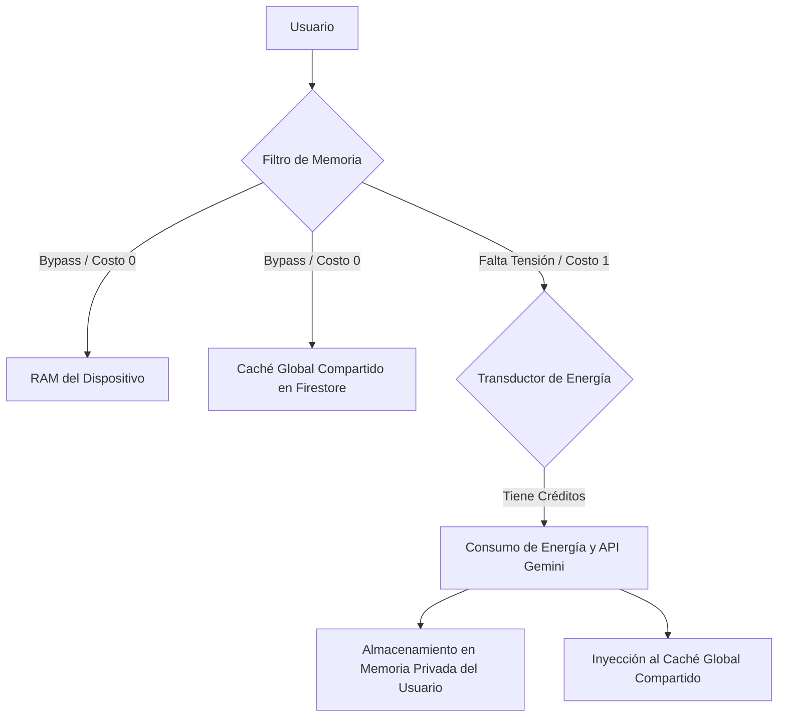

<div align="center">
  
  # 🇩🇪 DeutschMeister PRO A1
  
  **El estándar definitivo para dominar el alemán A1 y el vocabulario técnico de inserción laboral en la región DACH, impulsado por Inteligencia Artificial de vanguardia y arquitectura de grado industrial.**

  [](https://reactjs.org/)
  [](https://vitejs.dev/)
  [](https://capacitorjs.com/)
  [](https://deepmind.google/technologies/gemini/)
  [](https://firebase.google.com/)

  <br />
</div>

---

## 🎯 Objetivo del Proyecto

**DeutschMeister PRO A1** no es simplemente una aplicación de aprendizaje; es un ecosistema inmersivo de ingeniería de software educativo diseñado para hispanohablantes. Su propósito principal es acelerar la adquisición y dominio del nivel A1 de alemán, combinando métodos pedagógicos de retención comprobados con un backend serverless altamente optimizado y sistemas integrados de Inteligencia Artificial Generativa.

El software está concebido tanto para quienes aspiran a certificar el examen oficial **Goethe Zertifikat A1**, como para profesionales técnicos que requieren integrarse rápidamente a la fuerza laboral en Alemania, Austria o Suiza (región DACH), proporcionando herramientas contextuales avanzadas de traducción, simulación y generación multimedia.

---

## 🛠️ Arquitectura y Topología de Datos (Grado Industrial)

La infraestructura de la aplicación se diseñó y refactorizó siguiendo principios estrictos de sistemas de control e ingeniería de datos para garantizar robustez y economía de recursos:



### 1. Aislamiento Multi-Tenant (Seguridad de Datos)
Para prevenir el sangrado de datos (*Data Bleeding*), el sistema implementa una arquitectura multi-tenant estricta. La telemetría, el progreso en Quizzes, el historial del Tutor IA, las simulaciones de Roleplay y los cuentos generados se direccionan y aíslan de forma privada bajo el esquema `users/{userId}/...` utilizando reglas de seguridad avanzadas en Firebase. Cada sesión es un circuito cerrado e independiente.

### 2. Topología Híbrida de Caché (Shared Image Memory)
Para mitigar el sobreconsumo y optimizar la economía de tokens de la API visual de Gemini (`imagen-3.0-fast-generate-001`), se implementó un sistema de bypass en cascada:
*   **RAM local (Bypass instantáneo):** Si el componente mantiene la referencia de la imagen en memoria local, se renderiza de inmediato.
*   **Caché global compartido (`public_content/data/flashcardImages/{wordId}`):** Antes de consumir API, la aplicación consulta este caché común en Firestore. Si cualquier otro estudiante ya generó la imagen ilustrativa para esa palabra, el cliente la descarga directamente a **costo 0 de energía**, liberando al procesador y a la API de cálculos repetitivos.
*   **Generación e inyección distribuida:** Solo si la palabra carece de ilustración en el caché colectivo global, el transductor de energía consume 1 crédito, consulta la API de Gemini para generar una ilustración vectorial optimizada, e inmediatamente hace un *commit* dual: la inyecta en la vista del usuario y la almacena en el caché global para beneficio de toda la red de usuarios.

### 3. Transductor de Energía (Sistema de Créditos IA)
La ejecución de lógica de IA de alta intensidad de procesamiento (como la generación de cuentos y nuevas ilustraciones) está regulada por un acumulador de energía (sistema de créditos de usuario). Cada consulta de IA de alto coste consume créditos de la cuenta del usuario, lo que estabiliza el consumo de la API, evita sobrecargas y simula un entorno de facturación escalable.

---

## 📚 Mapeo Completo de Vocabulario y Plan de Estudios

La base de datos del vocabulario de la aplicación está estructurada en **16 capítulos fundamentales (Kapitel 0 al 15)** que cubren de manera exhaustiva todo el temario requerido para el nivel A1 y terminología técnica avanzada de la vida cotidiana en Alemania:

*   **Kapitel 0: Alphabet & Zahlen** (El alfabeto alemán, deletreo, números cardinales y ordinales, y operadores matemáticos básicos).
*   **Kapitel 1: Zeit & Datum** (Estructura temporal: días de la semana, meses, estaciones del año, partes del día y lectura horaria formal/informal).
*   **Kapitel 2: Personen & Kontakte** (Fórmulas de saludo y presentación, datos personales de contacto, nacionalidades, profesiones y pronombres personales).
*   **Kapitel 3: Wohnen** (El hogar: tipos de vivienda, habitaciones, mobiliario detallado, electrodomésticos y preposiciones de lugar estáticas).
*   **Kapitel 4: Freizeit** (Actividades de ocio, hobbies, deportes y el uso de los complejos verbos separables en presente).
*   **Kapitel 5: Essen & Trinken** (Alimentación: frutas, verduras, carnes, lácteos, comidas preparadas, compras en el supermercado y verbos modales de deseo/habilidad).
*   **Kapitel 6: Einkaufen** (El comercio: tiendas, ropa, tallas, colores, precios y la introducción práctica al caso Acusativo).
*   **Kapitel 7: Reisen & Verkehr** (Movilidad: medios de transporte terrestres y aéreos, indicaciones en la estación de tren, viajes y el tiempo pasado Perfekt con *haben* y *sein*).
*   **Kapitel 8: Post & Bank** (Trámites y servicios postales, transacciones bancarias, dinero físico, divisas y redacción de cartas formales).
*   **Kapitel 9: Gesundheit** (Cuidado de la salud: partes de la anatomía humana, síntomas de enfermedades, la consulta del médico y el uso del modo Imperativo).
*   **Kapitel 10: Kleidung** (Prendas de vestir en profundidad, accesorios, el concepto de estilo y la declinación básica de adjetivos).
*   **Kapitel 11: Schule & Beruf** (El ámbito educativo y laboral: asignaturas, herramientas de trabajo, la oficina moderna y la formulación de opiniones profesionales).
*   **Kapitel 12: Fahrschuldeutsch: Auto** *(Módulo Técnico Especializado)* (Términos esenciales para la autoescuela alemana, partes del vehículo, reglas de tráfico y vocabulario de seguridad vial para la obtención de la licencia de conducir).
*   **Kapitel 13: Grammatik: Konnektoren** (Sintaxis avanzada de nivel A1: conectores de posición cero como ADUSO, y conectores subordinantes de transposición verbal como *weil, dass, wenn*).
*   **Kapitel 14: Basisverben & Adjektive** (Los verbos de acción y adjetivos calificativos más frecuentes para la construcción de frases de uso diario).
*   **Kapitel 15: Adverbien & Fragewörter** (Adverbios de tiempo y espacio, y la matriz completa de pronombres interrogativos abiertos "W-Fragen").

---

## ⚡ Características Principales y Funciones de IA de Alto Impacto

### 1. 📖 Clases Magistrales e Interactive Presentations (Google Drive)
Cada uno de los 16 capítulos cuenta con un **botón de enlace directo a una presentación de diapositivas interactiva** alojada en la nube (Google Drive). Estas presentaciones actúan como clases magistrales visuales que exponen detalladamente las reglas gramaticales específicas, esquemas de conjugación, fonética y tablas de declinaciones del capítulo, sirviendo como la preparación teórica perfecta antes del entrenamiento con las tarjetas de memoria.

### 2. 📝 Cuentos IA (AI Story Generator)
Ubicado de forma destacada en la cabecera de cada Kapitel, este generador es un potente motor cognitivo de lectura comprensiva. Al activarse, invoca a **Google Gemini** para redactar un relato exclusivo y adaptado al nivel A1 utilizando **únicamente el vocabulario y las estructuras gramaticales de ese capítulo específico**. 
*   **Traducción Paralela Integrada:** Permite alternar instantáneamente la traducción de la historia en español para una autoevaluación inmediata.
*   **Gestión de Consumo de la API:** Al ser una tarea de alto consumo de procesamiento lingüístico, su uso consume créditos activos del sistema de energía del usuario para asegurar un uso equilibrado y sostenible de la API.

### 3. 🗣️ Tutor IA Conversacional 24/7
Un chat pedagógico que actúa como un profesor nativo de alemán en tu bolsillo. Cuenta con memoria contextual persistente aislada por usuario y está programado para resolver dudas de gramática, explicar errores comunes en tiempo real y guiarte con analogías precisas.

### 4. 🎭 Simulador de Rol A1 (Roleplay)
Prueba tus habilidades de comunicación simulando situaciones prácticas cotidianas en entornos de la región DACH (pedir café en Berlín, reservar un hotel en Zúrich). La IA adopta la personalidad del interlocutor nativo y te evalúa bajo criterios estrictos del Goethe Zertifikat, sin salir del nivel de dificultad adecuado.

### 5. ✉️ Evaluador de Exámenes de Redacción
El simulador de correo electrónico te plantea desafíos reales de redacción del examen Goethe Zertifikat A1. Al redactar tu respuesta, la IA analiza y desglosa tu rendimiento: cuenta el número de palabras, valida la estructura formal (saludos, despedidas) y corrige la posición de los verbos en oraciones principales y subordinadas, dándote retroalimentación idéntica a la de un examinador oficial.

### 6. 🎧 Sícs de Voz Nativa (Text-To-Speech)
Todas las palabras de los 16 capítulos cuentan con reproducción de audio nativa mediante síntesis de voz nativa de alta fidelidad, entrenando el oído del estudiante con la acentuación y fonética de habla alemana estándar (*Hochdeutsch*).

---

## 🚀 Guía de Inicio Rápido (Local & Compilación APK)

### 1. Clonar y Preparar el Entorno
```bash
git clone https://github.com/TU_USUARIO/DeutschMeister-PRO-A1.git
cd "DeutschMeister-PRO-A1"
npm install
```

### 2. Configurar Variables de Entorno
Crea un archivo `.env` en la raíz del proyecto y define los siguientes parámetros del circuito:
```env
VITE_GEMINI_API_KEY="tu_api_key_de_gemini_aqui"
VITE_FIREBASE_API_KEY="tu_firebase_api_key"
VITE_FIREBASE_AUTH_DOMAIN="tu_proyecto.firebaseapp.com"
VITE_FIREBASE_PROJECT_ID="tu_proyecto"
VITE_FIREBASE_STORAGE_BUCKET="tu_proyecto.firebasestorage.app"
VITE_FIREBASE_MESSAGING_SENDER_ID="123456789"
VITE_FIREBASE_APP_ID="1:12345:web:abcd"
```

### 3. Ejecución en Entorno Local (Desarrollo)
Para lanzar el servidor de desarrollo web ultrarrápido con Vite:
```bash
npm run dev
```

### 4. Compilación del APK Nativo (Android)
Para empaquetar y generar el ejecutable nativo de Android utilizando Capacitor y Gradle, ejecuta el siguiente pipeline consolidado en tu terminal de Windows:
```powershell
cmd /c "npm run build && npx cap sync android && rmdir /s /q android\app\build & set JAVA_HOME=C:\Program Files\Android\Android Studio\jbr&& cd android && gradlew assembleDebug"
```
El instalador final (`app-debug.apk`) se generará automáticamente en:
`android/app/build/outputs/apk/debug/app-debug.apk`

---

<div align="center">
  <small>DeutschMeister PRO A1 - Un puente tecnológico e inteligente hacia el dominio del idioma alemán. Desarrollado con ❤️ para la comunidad global de estudiantes y profesionales.</small>
</div>
