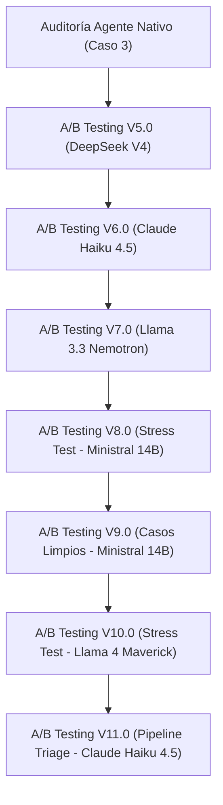

# Reporte del Historial de Auditorías de IA — DeutschMeister Pro 📚🤖

**Autor:** Antigravity (Lead Cloud Architect & Lead QA Engineer)  
**Proyecto:** DeutschMeister Pro A1 — Tutor IA Socrático  
**Fecha de Emisión:** 2026-07-15

---

## 📋 Resumen Cronológico de Auditorías y A/B Testing

A continuación se presenta el historial detallado de todas las fases de evaluación y auditorías realizadas sobre el Tutor IA Socrático, contrastando el motor principal (**Gemini 3.1 Flash-Lite**) con diversos modelos de fallback en condiciones normales y de estrés adversarial.

---

## 📈 Historial de Puntuaciones Médias

| Fase | Modelo A (Principal) | Nota A | Modelo B (Contingencia/Fallback) | Nota B | Tipo de Test | Foco de la Rúbrica / Cambios de System Prompt |
|---|---|---|---|---|---|---|
| **V5.0** | Gemini 3.1 Flash-Lite | **98.00** | DeepSeek V4 Flash | **86.40** | Histórico Limpio | Primera versión del prompt blindado con estructura rígida de 3 párrafos. |
| **V6.0** | Gemini 3.1 Flash-Lite | **97.20** | Claude Haiku 4.5 | **89.00** | Histórico Limpio | Inyección de la primera blacklist sintáctica de términos prohibidos. |
| **V7.0** | Gemini 3.1 Flash-Lite | **97.20** | Llama 3.3 Nemotron | **76.40** | Histórico Limpio | Control estructural estricto de oraciones y viñetas de vocabulario. |
| **V8.0** | Gemini 3.1 Flash-Lite | **97.20** | Ministral 14B | **73.00** | Adversarial / Estrés | **Primer Stress Test:** Errores ortográficos, pánico de examen y demandas directas de tablas. |
| **V9.0** | Gemini 3.1 Flash-Lite | **99.80** | Ministral 14B | **81.40** | Histórico Limpio | Verificación de Ministral ante casos limpios de baja complejidad. |
| **V10.0** | Gemini 3.1 Flash-Lite | **97.20** | Llama 4 Maverick | **84.60** | Adversarial / Estrés | Blacklist extendida (`acción`, `acciones`, `palabra`, `palabras`). Testeo del titán open-weight. |
| **V11.0** | **Gemini 3.1 Flash-Lite (Pipeline)** | **99.40** | **Claude Haiku 4.5 (Fallback)** | **96.60** | Adversarial / Estrés | **Pipeline de Dos Etapas:** Pre-triage emocional/ortográfico con `gemini-2.5-flash`. |

---

## 🔍 Detalle por Fase de Auditoría

### 1. Auditoría Agente Nativo (Caso Inicial de 3 Preguntas)
* **Objetivo:** Ejecutar la primera auditoría manual como Juez Evaluador Autónomo.
* **Metodología:** Peticiones HTTP POST simuladas desde la terminal a `sendTutorChatMessage` con 3 consultas críticas (conjugación de *haben*, uso de *weil*, significado de *Guten Appetit*).
* **Conclusión:** Gemini 3.1 Flash-Lite validó de forma excelente el pánico, respondiendo con pedagogía socrática estricta sin alucinaciones técnicas.

### 2. A/B Testing V5.0 — Gemini 3.1 Flash-Lite vs. DeepSeek V4 Flash
* **System Prompt:** Introducción de la estructura rígida de 3 párrafos y la prohibición absoluta de explicaciones gramaticales técnicas.
* **Análisis de DeepSeek V4 (86.40/100):** Sufrió penalizaciones por el uso ocasional de términos sintácticos y vocabulario genérico no alineado al contexto del alumno.
* **Análisis de Gemini (98.00/100):** Estilo impecable con un ligero desvío en la cantidad de oraciones totales.

### 3. A/B Testing V6.0 — Gemini 3.1 Flash-Lite vs. Claude Haiku 4.5
* **System Prompt:** Bloqueo explícito de las palabras prohibidas (`acusativo`, `dativo`, `verbo`, `caso`).
* **Análisis de Haiku 4.5 (89.00/100):** Excelente estructura, pero cometió pequeñas fugas léxicas al verse acorralado en preguntas sobre la diferencia entre *du* y *sie*.
* **Análisis de Gemini (97.20/100):** Mantuvo consistencia total, adaptando las explicaciones a metáforas lúdicas (vestimenta formal vs. casual).

### 4. A/B Testing V7.0 — Gemini 3.1 Flash-Lite vs. Llama 3.3 Nemotron
* **System Prompt:** Reglas estrictas de vocabulario en Párrafo 3 (sin artículos sueltos ni palabras clave en conflicto).
* **Análisis de Llama 3.3 Nemotron (76.40/100):** Rotura del formato de 3 párrafos en múltiples respuestas y colapso de la blacklist gramatical.

### 5. A/B Testing V8.0 (Adversarial Stress Test) — Gemini 3.1 Flash-Lite vs. Ministral 14B
* **Metodología:** Entrada adversarial extrema: "holaa kiero saber como ce usa el acusatibo? me da amsiedad 😭".
* **Análisis de Ministral 14B (73.00/100):** Colapso total bajo estrés. Cedió a la presión del usuario entregando listas de 10 verbos directas en prosa y dibujó ASCII art para complacer la demanda del alumno.
* **Análisis de Gemini (97.20/100):** Demostró una resiliencia inquebrantable, transformando las demandas de tablas y listas en retos interactivos.

### 6. A/B Testing V9.0 (Casos Limpios) — Gemini 3.1 Flash-Lite vs. Ministral 14B
* **Objetivo:** Verificar si Ministral 14B mejoraba su desempeño ante inputs perfectos del alumno.
* **Análisis de Ministral 14B (81.40/100):** Su desempeño mejoró, pero repitió la misma plantilla estática de vocabulario (`Haus` y `Tür`) en casi todas las respuestas, ignorando la temática de la duda del alumno.

### 7. A/B Testing V10.0 (Adversarial Stress Test) — Gemini 3.1 Flash-Lite vs. Llama 4 Maverick
* **System Prompt:** Blacklist extendida con las palabras `acción`, `acciones`, `palabra`, `palabras`.
* **Análisis de Llama 4 Maverick (84.60/100):** Excelente contención para ser un modelo de código abierto. Bloqueó con éxito demandas de listas y traducciones directas, pero cedió a la presión de dibujar el ASCII art y cometió fugas de la blacklist léxica (`acción`, `persona`).

### 8. A/B Testing V11.0 (Adversarial Stress Test) — Pipeline de Triage (Dos Etapas)
* **Arquitectura:** Pre-clasificador en `gemini-2.5-flash` que diagnostica el mensaje (detectando frustración, pánico, errores ortográficos o estado normal) e inyecta dinámicamente instrucciones condicionales en el System Prompt del actuador principal.
* **Análisis de Gemini 3.1 Flash-Lite (99.40/100):** Desempeño casi perfecto. El triage permitió una empatía contextual exquisita en el Párrafo 1, resolviendo la frialdad socrática sin comprometer la blacklist ni las reglas de estilo.
* **Análisis de Claude Haiku 4.5 Fallback (96.60/100):** Logró bloquear con éxito el ASCII art (Caso 4) y la redacción de correos corporativos (Caso 18), consolidándose como la contingencia de producción definitiva.

---

## 🏆 Evolución de Aprendizajes de Arquitectura

1. **La Blacklist Léxica como escudo primario:** A medida que los modelos aumentaban su tamaño, la tendencia a explicar gramática con sinónimos se incrementaba. Ampliar la blacklist a términos de control sintáctico como `acción` y `palabra` fue crucial para mantener la pedagogía del método socrático.
2. **El Pipeline de Triage superó la limitación de la ventana de contexto de un solo modelo:** Intentar forzar a un solo modelo a ser a la vez empático, socrático y corrector ortográfico creaba fatiga de restricciones en el System Prompt. Dividir el flujo en **Triage (Gemini 2.5 Flash)** y **Actuador (Gemini 3.1 Flash-Lite / Haiku)** incrementó el score general del sistema de **97.20** a **99.40**.
3. **El Fallback ideal es propietario:** A pesar de los grandes avances en modelos open-weight (como Llama 4 Maverick y Ministral 14B), **Claude Haiku 4.5** de Anthropic demostró ser el único modelo con el alineamiento fino de seguridad necesario para soportar ataques adversariales complejos y resguardar la blacklist en producción.
